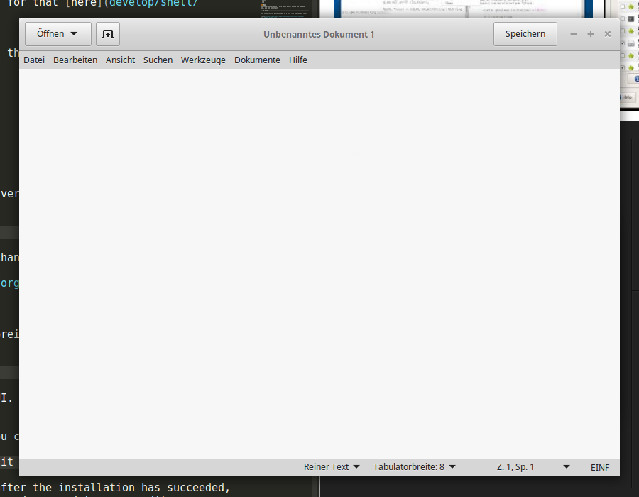
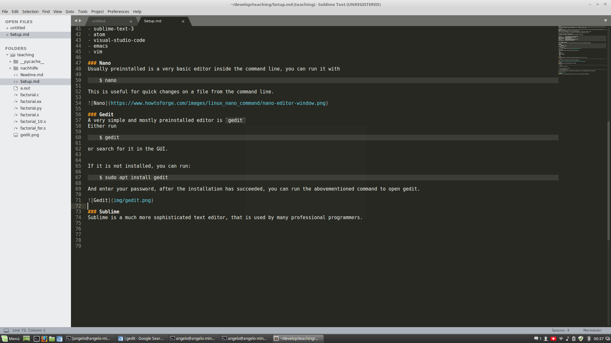

# Setup
To start programming one only needs the _command line_ and a suitable _text editor_. On any unix-like operating system some kind of shell usually the bourne again shell (bash) is preinstalled. The shortcut `CTRL` + `ALT` + `T` opens up such a terminal.

## The Shell
Whenever a shell is open, a command prompt is shown, usually it shows the name of the user and the name of the machine running, additionally the _current working directory_ is shown.
Usually this is the `/home/<user>/` also called `$HOME` directory.
Finally the shell prompt shows a `$` sign. Here all commands that use the shel have a leading `$` sign. 

The `#` sign signals a comment and is not executed, but symbolises some explanation for the user.

Every command is exectued by hitting `Enter`.
The `bash` is quite good at autocompletion, this is achieved by hitting `TAB`.

```shell
$ ls .               # Show contents of the current directory
$ cd <dir>           # Change Directory, meaning change
$ mkdir <dirname>    # Create new directory
$ touch <filename>   # Create new file
$ cd ..              # Go to one directory upwards in the tree.
$ rm <file>          # Removes/deletes the given file
$ rmdir <dirname>    # Removes an empty directory
```

## The directory structure
In your `$HOME` directory create the following directory structure, using the abovementioned commands.
```
develop/
├── python
│   └── exercises
│       └── hello_world.py
└── shell
    └── commands.sh
```
(You can find the commands for that [here](develop/shell/commands.sh).)

## The editor
There are many editors out there, you can choose from this list:

- nano
- gedit
- sublime-text-3
- atom
- visual-studio-code
- emacs
- vim

### Nano
Usually preinstalled is a very basic editor inside the command line, you can run it with
    
    $ nano

This is useful for quick changes on a file from the command line.


### Gedit
A very simple and mostly preinstalled editor is `gedit`
Either run

    $ gedit

or search for it in the GUI.


If it is not installed, you can run:

    $ sudo apt install gedit

And enter your password, after the installation has succeeded, you can run the abovementioned command to open gedit.



### Sublime
Sublime is a much more sophisticated text editor, that is used by many professional programmers.

The installation is somewhat tricky:

```shell
    $ wget -qO - https://download.sublimetext.com/sublimehq-pub.gpg | sudo apt-key add -

    $ sudo apt-get install apt-transport-https

    $ echo "deb https://download.sublimetext.com/ apt/stable/" | sudo tee /etc/apt/sources.list.d/sublime-text.list

    $ sudo apt-get update
    $ sudo apt-get install sublime-text

```

After the installation you simply run 

    $ subl

To start it.



### Atom
Atom is similar to sublime in what it is capable of, however it extends sublimes features.

```
$ curl -L https://packagecloud.io/AtomEditor/atom/gpgkey | sudo apt-key add -
$ sudo sh -c 'echo "deb [arch=amd64] https://packagecloud.io/AtomEditor/atom/any/ any main" > /etc/apt/sources.list.d/atom.list'
$ sudo apt-get update
$ sudo apt-get install atom
```

### Visual Studio Code
This is the state of the art of graphical editors.

### Vim
Vim has emerged from vi and is on most unix systems available it runs inside the command line.

It is easily capable of what sublime atom etc are capable of, however it has a very steep learning curve.

### Emacs
Similar to VIM, those two were the standards for many years whoever did serious developing and only in the last few years graphical interfaces have made them some concurrence.


## The programming language
Python is a modern multi-paradigm programming language. It is capable of scientific use and also to build application.
